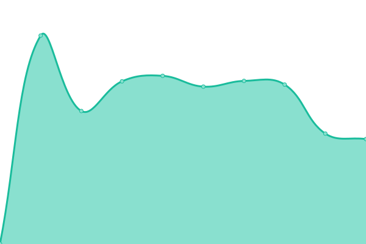

# [📈 Live Status](https://status.cachetech.com.au): <!--live status--> **🟧 Partial outage**

This repository contains the open-source uptime monitor and status page for [Upptime](https://upptime.js.org), powered by [Upptime](https://github.com/upptime/upptime).

With [Upptime](https://upptime.js.org), you can get your own unlimited and free uptime monitor and status page, powered entirely by a GitHub repository. We use [Issues](https://github.com/upptime/upptime/issues) as incident reports, [Actions](https://github.com/cachetech/service-status/actions) as uptime monitors, and [Pages](https://status.cachetech.com.au) for the status page.

<!--start: status pages-->
<!-- This summary is generated by Upptime (https://github.com/upptime/upptime) -->
<!-- Do not edit this manually, your changes will be overwritten -->
<!-- prettier-ignore -->
| URL | Status | History | Response Time | Uptime |
| --- | ------ | ------- | ------------- | ------ |
|  [CacheTech](https://cachetech.com.au/) | 🟥 Down | [cache-tech.yml](https://github.com/cachetech/service-status/commits/HEAD/history/cache-tech.yml) | 

 804ms
     
 | 

<a href="https://status.cachetech.com.au/history/cache-tech">0.00%</a>
    

|  [CacheTech Billing](https://billing.cachetech.com.au/) | 🟩 Up | [cache-tech-billing.yml](https://github.com/cachetech/service-status/commits/HEAD/history/cache-tech-billing.yml) | 

 1873ms
     
 | 

<a href="https://status.cachetech.com.au/history/cache-tech-billing">100.00%</a>
    

|  CacheTech Cloud | 🟩 Up | [cache-tech-cloud.yml](https://github.com/cachetech/service-status/commits/HEAD/history/cache-tech-cloud.yml) | 

 1092ms
     
 | 

<a href="https://status.cachetech.com.au/history/cache-tech-cloud">100.00%</a>
    

|  [cache.bi Landing Page](https://cache.bi/) | 🟩 Up | [cache-bi-landing-page.yml](https://github.com/cachetech/service-status/commits/HEAD/history/cache-bi-landing-page.yml) | 

 2366ms
     
 | 

<a href="https://status.cachetech.com.au/history/cache-bi-landing-page">100.00%</a>
    

|  [cache.bi Portal](https://portal.cache.bi/) | 🟩 Up | [cache-bi-portal.yml](https://github.com/cachetech/service-status/commits/HEAD/history/cache-bi-portal.yml) | 

 719ms
     
 | 

<a href="https://status.cachetech.com.au/history/cache-bi-portal">100.00%</a>
    

|  [cache.bi Portal API](https://portal.api.cache.bi/_health) | 🟩 Up | [cache-bi-portal-api.yml](https://github.com/cachetech/service-status/commits/HEAD/history/cache-bi-portal-api.yml) | 

 755ms
     
 | 

<a href="https://status.cachetech.com.au/history/cache-bi-portal-api">100.00%</a>
    

|  [cache.bi Portal Data Service](https://data.api.cache.bi/_health) | 🟩 Up | [cache-bi-portal-data-service.yml](https://github.com/cachetech/service-status/commits/HEAD/history/cache-bi-portal-data-service.yml) | 

 649ms
     
 | 

<a href="https://status.cachetech.com.au/history/cache-bi-portal-data-service">100.00%</a>
    

|  [cache.bi User Service](https://auth.cache.bi/) | 🟩 Up | [cache-bi-user-service.yml](https://github.com/cachetech/service-status/commits/HEAD/history/cache-bi-user-service.yml) | 

 659ms
     
 | 

<a href="https://status.cachetech.com.au/history/cache-bi-user-service">100.00%</a>
    

|  cache.bi Account Service | 🟥 Down | [cache-bi-account-service.yml](https://github.com/cachetech/service-status/commits/HEAD/history/cache-bi-account-service.yml) | 

 748ms
     
 | 

<a href="https://status.cachetech.com.au/history/cache-bi-account-service">59.05%</a>
    

|  [CBTB Coffee House Shop](https://shop.cbtb.coffee/) | 🟩 Up | [cbtb-coffee-house-shop.yml](https://github.com/cachetech/service-status/commits/HEAD/history/cbtb-coffee-house-shop.yml) | 

 1754ms
     
 | 

<a href="https://status.cachetech.com.au/history/cbtb-coffee-house-shop">95.48%</a>
    

|  CBTB Coffee House Cloud | 🟩 Up | [cbtb-coffee-house-cloud.yml](https://github.com/cachetech/service-status/commits/HEAD/history/cbtb-coffee-house-cloud.yml) | 

 972ms
     
 | 

<a href="https://status.cachetech.com.au/history/cbtb-coffee-house-cloud">100.00%</a>
    

<!--end: status pages-->

[**Visit our status website →**](https://status.cachetech.com.au)

## 📄 License

- Powered by: [Upptime](https://github.com/upptime/upptime)
- Code: [MIT](./LICENSE) © [Upptime](https://upptime.js.org)
- Data in the `./history` directory: [Open Database License](https://opendatacommons.org/licenses/odbl/1-0/)
